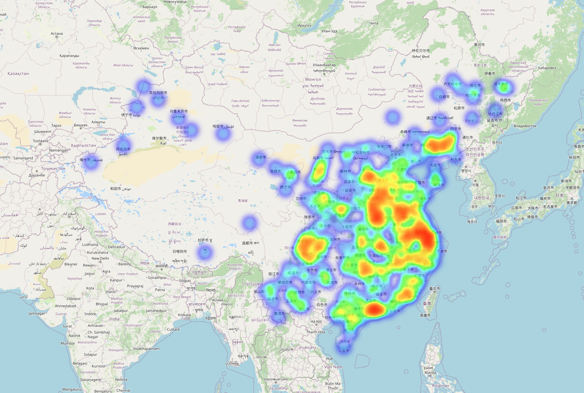

# Fuzzy Matching of Personal Information Based on Baidu Maps API
 Total of four documents, which will be described separately below

## Table of Contents

* [Main Feature](#Main_Feature)
* [Usage and Execution](#Usage_and_Execution)
* [Examples and Results](#Examples_and_Results)
* [File Description](#File_Description)
* [All in All](#All_in_All)

## Main_Feature
This program performs fuzzy matching for specialized strings—hospital names, involving patterns such as containment relationships, keyword search, and map API matching.
## Usage_and_Execution
- The required modules to run this program are: cx_Oracle, xlsxwriter, pandas, time, json, urllib.request, geopy.distance, etc.
- geopy only supports Python 3
- For optimal performance and speed, it is recommended to complete the environment setup through the [**requirements.txt**](https://github.com/yingjiaxuan/Intern_2_public/blob/master/requirements.txt)

1. Using requirements.txt
```shell
pip install -r requirements.txt
```

2. Using PypI one by one, such as:
```shell
pip install cx_Oracle
```

**Note**: The geopy package currently and in the future supports Python 3 versions
## Examples_and_Results
1. The following selection of 7 sets of typical raw data showcases the annotated results:

| Hos_Source | Hos_Preference | Reliability |
| :-----: | :--------: |:-----------:|
|   北京市门头沟区医院  |     北京市门头沟区医院 |      1      |
| 青海红十字医院 |    青海省西宁市红十字会医院（青海红十字医院）|      2      |
| 厦门市第二医院 |    福建省厦门医学院附属第二医院|      3      |
| 赣州市第五人民医院 |    江西省赣州市肺科医院|      4      |
| 武侯区第三人民医院 |    四川省成都市武侯区第五人民医院|     -1      |
| 中国人民解放军总医院301医院 |    空军航空医学研究所附属医院|     -2      |
| 包钢医院 |    内蒙古包头市蒙医中医医院|      0      |

2. The significance of the reliability labels is as follows:

| *ID* | *Meaning* | 
| :-----: | :-------- | 
|1|Strings are exactly identical|
|2|Strings are mutually inclusive|
|3|Strings are determined to be the same hospital through the "No. X Hospital" logic|
|4|Strings are determined to be the same hospital if matched within 5km through coordinates|
|-1|Strings are determined not to be the same hospital through the "No. X Hospital" logic|
|-2|Strings are determined not to be the same hospital if matched beyond 5km through coordinates|
|0|Strings have no match in 1, 2, or 3, and no return value in 4, making it indeterminate|
|404|Network error, skipping verification|

3. A heatmap can be generated by analyzing the data:

[**HeatMap**](https://github.com/yingjiaxuan/Intern_2_public/blob/master/df.html)


## File_Description
1. [Check_Hos.py](https://github.com/yingjiaxuan/Intern_2_public/blob/master/Check_Hos.py)
Generate the corresponding Excel document based on the view (with generation coupling).
2. [Create_View.py](https://github.com/yingjiaxuan/Intern_2_public/blob/master/Create_view.py)
Add an additional confidence column to the generated Excel document.
3. [Fun_3.py](https://github.com/yingjiaxuan/Intern_2_public/blob/master/Fun_3.py)
Main method for string matching processing.
4. [Folium.py](https://github.com/yingjiaxuan/Intern_2_public/blob/master/Folium.py)
Generate a matching heatmap based on the matching results.
5. [TEM_1.xlsx](https://github.com/yingjiaxuan/Intern_2_public/blob/master/TEM_1.xlsx)
Excel document generated from the corresponding view.
6. [TEM_3.xlsx](https://github.com/yingjiaxuan/Intern_2_public/blob/master/TEM_3.xlsx)
Excel document with completed confidence labels.
7. [df.html](https://github.com/yingjiaxuan/Intern_2_public/blob/master/df.html)
Generated matching heatmap.
8. [requirements.txt](https://github.com/yingjiaxuan/Intern_2_public/blob/master/requirements.txt)
Environment configuration file.

## All_in_All
If you have any questions or suggestions regarding this program, please feel free to send email to: [*yingjiaxuan123@gmail.com*](link)